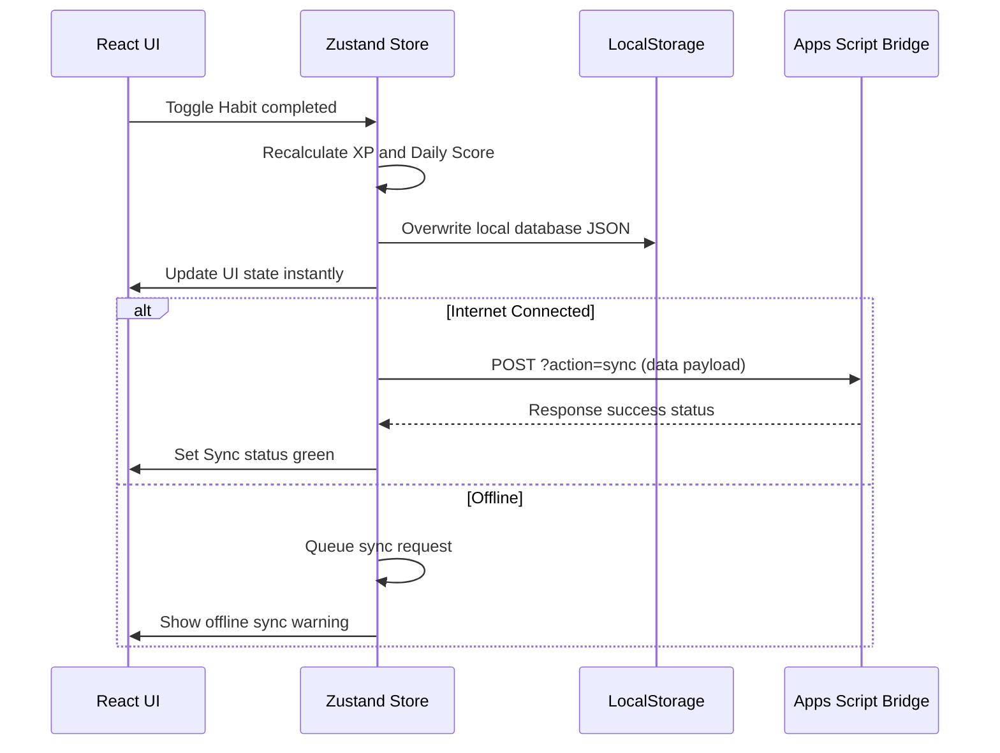
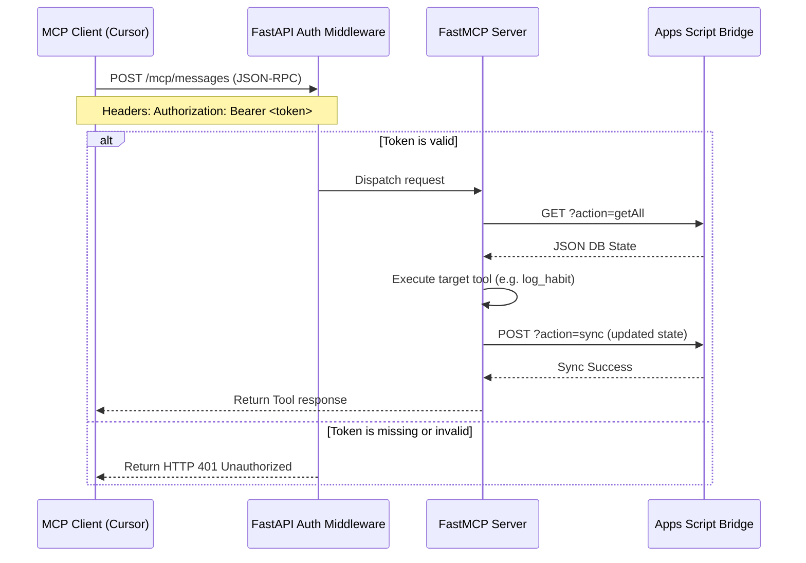

# 🚀 BakaTracker

[](docs/LICENSE.md)
[](https://www.typescriptlang.org/)
[](https://react.dev/)
[](https://github.com/modelcontextprotocol/)
[](https://www.google.com/sheets/about/)
[](https://pages.cloudflare.com/)
[](https://cloud.google.com/run)
[](https://developer.mozilla.org/en-US/docs/Web/Progressive_web_apps)
[](#)

> A minimalist, ADHD-friendly life operating system and RPG planner powered by Google Sheets and the Model Context Protocol (MCP).

---


## 🗺️ Table of Contents

1. [Introduction](#-introduction)
2. [Feature Showcase](#-feature-showcase)
3. [Technical Architecture](#-technical-architecture)
4. [Technology Stack](#-technology-stack)
5. [Folder Structure](#-folder-structure)
6. [Database Schema](#-database-schema)
7. [Model Context Protocol (MCP)](#-model-context-protocol-mcp)
8. [API Specifications](#-api-specifications)
9. [Installation Guide](#-installation-guide)
10. [Deployment Guide](#-deployment-guide)
11. [Configuration](#-configuration)
12. [Authentication & Security](#-authentication--security)
13. [User Workflows](#-user-workflows)
14. [Developer Guide](#-developer-guide)
15. [Contributing](#-contributing)
16. [Roadmap](#-roadmap)
17. [Frequently Asked Questions (FAQ)](#-frequently-asked-questions-faq)
18. [Troubleshooting](#-troubleshooting)
19. [Changelog](#-changelog)
20. [License & Credits](#-license--credits)
21. [Future Vision](#-future-vision)

---

## 📌 Introduction

### Why BakaTracker Exists
Modern productivity applications are often designed as complex project management tools. They overwhelm users with nested databases, tags, subtasks, and analytics, inducing "productivity guilt" when a day is missed. 

BakaTracker is designed to be the antidote. It separates **planning** (Master board backlog) from **doing** (Today board focus) and encourages **consistency** over optimization.

### Philosophies
* **ADHD-First Design:** Minimizes execution friction. Check-ins are quick, and progress bars provide clear positive reinforcement.
* **Local-First Reliability:** UI renders instantly using local storage. Synchronization runs in the background.
* **Serverless Simplicity:** Uses Google Sheets as a relational database, hosted for free on your Google Drive.
* **Isolated AI Interface:** No AI assistant code cluttering the React client. Instead, it exposes an isolated Model Context Protocol (MCP) server so coding agents can access your data.

---

## 🎨 Feature Showcase

* **Habits Tracker:** Supports boolean checkbox toggles, counter habits (with per-click multipliers), mood ratings (`😞`, `😐`, `🙂`), energy logs (`Low`, `Medium`, `High`), and numeric inputs (e.g. sleep duration).
* **Kanban Backlog:** Track long-term tasks through a 4-column master board (`Backlog`, `Todo`, `Doing`, `Done`).
* **Today Focus Board:** Stars tasks from your backlog to pin them on a 3-column daily execution board (`Today`, `Doing`, `Done`).
* **Highlight Journaling:** Encourages logging a single highlight per day, with optional secondary notes.
* **RPG Character Engine:** Level up your profile across five attributes: **Discipline, Health, Knowledge, Creativity, and Career** based on habit and task categories.
* **Visual Analytics:** Custom Recharts charts for trends, and consistency heatmaps.
* **FastMCP Gateway:** Connects BakaTracker directly to Cursor, Claude, or VS Code using 22 tools and 5 Markdown resources.

---

## 🏗️ Technical Architecture

### Component Layout Diagram

```mermaid
graph TD
    subgraph Client Layer (Cloudflare Pages)
        React[React PWA Client]
        Store[Zustand Store]
        LocalDB[(LocalStorage)]
    end

    subgraph API Gateway Layer (Google Cloud Run)
        FastAPI[FastAPI Web Server]
        FastMCP[FastMCP Server Instance]
        SheetsClient[SheetsClient with 3x Backoff]
    end

    subgraph Database Layer (Google Workspace)
        GAS[Google Apps Script Bridge]
        Sheets[(Google Sheets Spreadsheet)]
    end

    React <-->|Zustand state bindings| Store
    Store <-->|Local Cache read/write| LocalDB
    Store -->|Sync POST JSON| GAS
    GAS <-->|Spreadsheet Service| Sheets
    
    FastAPI <-->|Route requests| FastMCP
    FastMCP -->|fetch_db/save_db| SheetsClient
    SheetsClient <-->|POST/GET JSON| GAS
    
    Cursor[Cursor / Claude Desktop / ChatGPT] <-->|Bearer Auth JSON-RPC| FastAPI
```

### Core Workflows

#### PWA State Synchronization Flow


#### Bearer Token Authentication Flow


---

## 💻 Technology Stack

* **React (v19) & Vite (v5):** React handles UI reactivity, while Vite provides fast HMR and builds.
* **TypeScript (v5):** Ensures type safety across store actions and database collections.
* **TailwindCSS (v4):** Handles layout styling.
* **Zustand (v4):** Manages local state persistence and background sync queues.
* **FastAPI (v0.115) & FastMCP (v1.28):** FastAPI handles web routing, and FastMCP registers tools.
* **Uvicorn (v0.34) & HTTPX (v0.28):** Uvicorn runs the server, and HTTPX handles resilient retries.
* **Google Sheets & Apps Script:** Serves as a free, serverless relational database.
* **Cloudflare Pages & Google Cloud Run:** Host the static frontend and containerized backend gateway.

---

## 📂 Folder Structure

```
BakaTracker/
├── .github/                  # GitHub Actions CI/CD workflows
│   └── workflows/
│       └── deploy.yml              # Backend Docker test and deployment gate
├── backend/                  # Python FastMCP server & FastAPI app
│   ├── models/                     # Pydantic schemas for sheets data
│   ├── services/
│   │   └── sheets_client.py        # Database client (10s timeout, 3x backoff)
│   ├── tools/                      # MCP tools (habits, tasks, quotes, events)
│   ├── main.py                     # FastAPI server and health check routes
│   ├── server.py                   # FastMCP instance registrations
│   ├── config.py                   # Centralized configuration parser
│   ├── Dockerfile                  # Container build config
│   ├── pyproject.toml              # UV project dependencies
│   ├── cloudbuild.yaml             # Google Cloud Build triggers
│   └── README.md                   # Backend local setup & dev guide
├── docs/                     # BakaTracker Documentation References
│   ├── ARCHITECTURE.md             # Systems overview & workflow diagrams
│   ├── DATABASE.md                 # Table mappings
│   ├── API.md                      # API endpoints
│   ├── MCP.md                      # Model Context Protocol
│   └── USER_GUIDE.md               # User manuals
├── public/                   # Frontend public assets (icons, manifest)
├── src/                      # Frontend source code (React 19)
│   ├── assets/                     # Styles, SVG icons, and drawings
│   ├── components/                 # UI components and layout screens
│   ├── lib/                        # XP, formulas, and timing utilities
│   ├── pages/                      # Habits, Tasks, Today, Journal, Journey
│   └── services/                   # Frontend sheets REST services
├── google-apps-script.js     # Sheets database proxy code
└── package.json              # Frontend node packages
```

---

## 🗄️ Database Schema

BakaTracker stores data in **10 sheets** inside your Google Sheet.

### Table Reference Schema

| Table Name | Primary Key | Foreign Keys | Key Columns | Purpose |
| :--- | :--- | :--- | :--- | :--- |
| **Settings** | `None` | `None` | `sheets_url`, `xp_per_level`, `api_key` | System URLs and security passcodes. |
| **Habits** | `id` | `None` | `name`, `type`, `xp`, `stat`, `active` | Configured tracker definitions. |
| **HabitLogs** | `Composite` | `habit_id` $\to$ `Habits.id` | `date`, `value`, `xp_earned` | Historical completion logs. |
| **Tasks** | `id` | `None` | `title`, `notes`, `status`, `today`, `xp` | Master and Today Kanban tasks. |
| **Journal** | `date` | `quote_id` $\to$ `Quotes.id` | `highlight`, `notes`, `mood` | Reflections journal timeline. |
| **Events** | `id` | `entity_id` $\to$ `Habits/Tasks` | `type`, `xp`, `stat`, `timestamp` | Audit log of all XP actions. |
| **Character** | `date` | `None` | `level`, `xp`, `discipline`, `health` | Chronological attribute snapshots. |
| **WeeklyStats** | `week_key` | `None` | `habits_completed`, `avg_sleep`, `xp_earned` | Aggregated weekly summaries. |
| **Metadata** | `key` | `None` | `value` | Key-value settings metadata. |
| **Quotes** | `id` | `None` | `quote`, `author`, `category`, `active` | Motivational quotes library. |

For column definitions and data types, see the [DATABASE.md](docs/DATABASE.md) manual.

---

## 🔌 Model Context Protocol (MCP)

BakaTracker exposes **22 tools** and **5 Markdown resources** to connected LLM clients.

### Available Tools Mappings

* **Habits:** `get_habits()`, `get_habit_logs(date)`, `log_habit(habit_id, date)`, `increment_habit(habit_id, amount, date)`, `set_habit_value(habit_id, value, date)`.
* **Tasks:** `get_tasks()`, `get_today_tasks()`, `create_task(title, notes, area, status, due_date, xp, today)`, `update_task(task_id, ...)`, `delete_task(task_id)`.
* **Journal:** `get_journal_entries()`, `save_journal_entry(date, highlight, notes, mood, quote_id)`.
* **Quotes:** `get_quotes()`, `get_random_quote()`.
* **Events:** `get_events()`, `get_recent_events(limit)`.
* **Journey & Quick Log:** `get_character_sheet()`, `get_weekly_stats()`, `get_day_summary(date)`, `get_weekly_wins(week_key)`, `quick_log(text)`.

### Resources
* `bakatracker://character`: Returns level, attributes, and tier titles.
* `bakatracker://today`: Returns today's active tasks and habit completion checklist.
* `bakatracker://weekly`: Returns weekly stats summaries.
* `bakatracker://journal`: Returns a reverse-chronological highlight timeline.
* `bakatracker://events`: Returns recent event transaction logs.

### Client Integration Setups

#### Cursor Configuration
1. Open Cursor Settings -> **Features** -> **MCP**.
2. Click **+ Add New MCP Server**.
3. Configure the settings:
   - **Name**: `BakaTracker`
   - **Type**: `http`
   - **URL**: `http://localhost:8080/mcp/`
   - **Headers**:
     - Key: `Authorization`
     - Value: `Bearer <your_auth_token>`

#### Claude Desktop
Open your Claude Desktop configuration file (`claude_desktop_config.json`):
- **Windows**: `%APPDATA%\Claude\claude_desktop_config.json`
- **macOS**: `~/Library/Application Support/Claude/claude_desktop_config.json`

Add the following under the `mcpServers` block (using `uv` to spawn it locally):
```json
{
  "mcpServers": {
    "bakatracker": {
      "command": "uv",
      "args": [
        "--directory",
        "C:/path/to/BakaTracker/backend",
        "run",
        "main.py"
      ],
      "env": {
        "GOOGLE_APPS_SCRIPT_URL": "https://script.google.com/macros/s/.../exec",
        "AUTH_TOKEN": "your_auth_token_here",
        "GOOGLE_APPS_SCRIPT_API_KEY": "your_api_key_here"
      }
    }
  }
}
```

#### VS Code / Cline Setup
Open your Cline settings configuration (`cline_mcp_settings.json`):
```json
{
  "mcpServers": {
    "bakatracker": {
      "command": "uv",
      "args": [
        "--directory",
        "C:/path/to/BakaTracker/backend",
        "run",
        "main.py"
      ],
      "env": {
        "GOOGLE_APPS_SCRIPT_URL": "https://script.google.com/macros/s/.../exec",
        "AUTH_TOKEN": "your_auth_token_here"
      }
    }
  }
}
```

#### MCP Inspector Setup
To test and debug using the official MCP Inspector:
1. Run the inspector client:
   ```bash
   npx @modelcontextprotocol/inspector
   ```
2. In the browser UI, configure the connection:
   - **Transport**: `Streamable HTTP`
   - **URL**: `http://localhost:8080/mcp`
   - **Headers**: `Authorization: Bearer <your_auth_token>`


---

## 🌐 API Specifications

### FastAPI Endpoints
* `GET /` (Public): Returns service configuration status.
* `GET /health` (Public): Returns server health status.
* `GET /version` (Public): Returns version numbers and environment metadata.
* `GET /ready` (Protected): Confirms connection to Google Apps Script.
* `GET /info` (Protected): Returns active tool/resource counts and SDK metadata.
* `GET /metrics` (Protected): Returns server uptime and total request volume.
* `/mcp` (Protected): SSE or Streamable HTTP endpoint for MCP.

For request/response JSON payload schemas, review the [API.md](docs/API.md) manual.

---

## ⚙️ Installation Guide

### Step 1: Clone the Repository
```bash
git clone https://github.com/srivatsacool/BakaTracker.git
cd BakaTracker
```

### Step 2: Configure Google Sheets Database
1. Create a blank Google Sheet.
2. Go to **Extensions** > **Apps Script**, delete the boilerplate code, and paste the contents of [google-apps-script.js](google-apps-script.js).
3. Click **Deploy** > **New deployment** > **Select type: Web app**.
4. Set **Execute as** to `Me` and **Who has access** to `Anyone`.
5. Deploy the script and copy the **Web App URL**.
6. Set a custom security passcode in the `api_key` cell under the newly created **Settings** tab.

### Step 3: Run the React PWA locally
1. Install dependencies:
   ```bash
   npm install
   ```
2. Start the development server:
   ```bash
   npm run dev
   ```
3. Access the app at `http://localhost:5173`. Open the Settings tab (gear icon) and configure your Apps Script URL.

### Step 4: Run the Backend locally
1. Install [uv](https://github.com/astral-sh/uv). Navigate to the `backend/` directory:
   ```bash
   cd backend
   uv sync
   ```
2. Create `.env` from the template:
   ```bash
   cp .env.example .env
   ```
3. Start the server locally:
   ```bash
   # Windows PowerShell
   $env:GOOGLE_APPS_SCRIPT_URL="https://script.google.com/macros/s/your_script/exec"
   $env:AUTH_TOKEN="test_token"
   uv run uvicorn main:app --port 8080
   ```

---

## 🚢 Deployment Guide

### Frontend Deployment (Cloudflare Pages)
1. In the Cloudflare Dashboard, select **Workers & Pages** > **Pages** > **Connect to Git**.
2. Select your repository. Set build parameters:
   * **Framework preset:** `Vite`
   * **Build command:** `npm run build`
   * **Build output directory:** `dist`
3. Add environment variables:
   * `VITE_GOOGLE_APPS_SCRIPT_URL`: Your Apps Script deployment URL.
   * `VITE_GOOGLE_APPS_SCRIPT_API_KEY`: (Optional) Your security passcode.

### Backend Deployment (Google Cloud Run)
Deploy the backend using the Cloud SDK CLI:
```bash
cd backend
gcloud run deploy bakatracker-mcp \
  --source . \
  --region us-central1 \
  --platform managed \
  --cpu 0.25 \
  --memory 512Mi \
  --concurrency 80 \
  --timeout 300 \
  --min-instances 0 \
  --max-instances 5 \
  --allow-unauthenticated \
  --set-env-vars GOOGLE_APPS_SCRIPT_URL=YOUR_URL,AUTH_TOKEN=YOUR_TOKEN,LOG_LEVEL=INFO
```

---

## 🔧 Configuration Options

| Variable Name | Environment | Default Value | Description |
| :--- | :--- | :--- | :--- |
| `GOOGLE_APPS_SCRIPT_URL` | Backend / Frontend | `None` (Required) | The Web App execution URL of your Apps Script deployment. |
| `AUTH_TOKEN` | Backend | `None` (Required) | Secret Bearer Token required to authorize incoming MCP calls. |
| `GOOGLE_APPS_SCRIPT_API_KEY`| Backend / Frontend | `None` (Optional) | Security key protecting the Google Apps Script Web App. |
| `PORT` | Backend | `8080` | Port uvicorn binds to. |
| `LOG_LEVEL` | Backend | `INFO` | Standard log output severity. |
| `TIMEOUT` | Backend | `10.0` | Maximum timeout in seconds for Apps Script requests. |

---

## 🛡️ Authentication & Security

* **Bearer Token Gateway:** All protected FastAPI endpoints and mounted MCP sub-apps require `Authorization: Bearer <AUTH_TOKEN>` headers.
* **Sheets API Key:** Prevents access to the public Google Apps Script Web App if the URL is discovered. Set this in the spreadsheet settings tab.
* **Workload Security:** Secrets are injected in production using Cloud Run environment variables to keep them out of source control.

---

## 📖 User Workflows

```
   [ Morning Checklist ]                    [ Afternoon Focus ]                    [ Evening Reflections ]
   1. Open Habits board.                    1. Navigate to Today page.             1. Log completed habits.
   2. Read quote of the day.                2. Pick 1-3 tasks from backlog.        2. Mark finished tasks as Done.
   3. Star tasks for today.                 3. Drag quests to "Doing".             3. Write 1-sentence Highlight.
```

Review the [USER_GUIDE.md](docs/USER_GUIDE.md) manual for a detailed walk-through on habits, tasks, journaling, and tracking progression.

---

## 🛠️ Developer Guide

Developers should refer to [DEVELOPMENT.md](docs/DEVELOPMENT.md) for local setups.

### Key Architectural Guidelines
1. **Zustand Actions:** Do not trigger REST API operations directly from React files. Wrap all operations inside Zustand store actions (`src/store/useStore.ts`).
2. **Explicit Awaits:** List and call operations in FastMCP are asynchronous. Always use the `await` keyword.
3. **Resilience Policy:** The sheets client enforces a strict **10s request timeout** and **3x retry backoff** (0.5s, 1s, 2s). Keep timeouts aligned across the frontend and backend.

---

## 🤝 Contributing

BakaTracker is open-source. For instructions on branching, commit guidelines, and pull requests, please read the [docs/CONTRIBUTING.md](docs/CONTRIBUTING.md) manual.

---

## 🗺️ Roadmap

### Version 1.1 (Near-Term)
* **Conflict Resolution:** Compare local and remote edit timestamps to prompt merge warnings instead of overwriting sheets.
* **Habit Archiving:** Hides habits from the active Habits board while preserving historical Journey streaks.

### Version 2.0 (Mid-Term)
* **SQLite Database Fallback:** Standalone IndexedDB/SQLite support to run BakaTracker locally without requiring Google Sheets.
* **Achievement Badges:** Progression titles and achievement badges.

---

## 💬 Frequently Asked Questions (FAQ)

Answering 30 common questions about database hosting, offline support, security, and MCP integrations:

<details>
<summary><b>1. Can I self-host BakaTracker?</b> (Click to expand)</summary>
Yes. The PWA can be hosted on any static hosting provider (Cloudflare Pages, Vercel, Netlify) and the backend MCP server can run on Cloud Run, Render, or a VPS.
</details>

<details>
<summary><b>2. Do I need to pay any server or hosting fees?</b></summary>
No. The frontend, backend, and Google Sheets database fit entirely within the free tiers of Cloudflare, Google Cloud, and Google Workspace.
</details>

<details>
<summary><b>3. Can I replace Google Sheets with a SQL database like PostgreSQL?</b></summary>
Not in Version 1.0. Support for alternate backends is planned for future releases.
</details>

<details>
<summary><b>4. What happens if I go offline? Will I lose my data?</b></summary>
No. BakaTracker is offline-first. All writes are saved locally to `localStorage` immediately and queued for background syncing when connection returns.
</details>

<details>
<summary><b>5. Can I connect BakaTracker to Notion?</b></summary>
No. Notion's API is too slow for real-time background syncs and does not support BakaTracker's JSON sync payloads.
</details>

<details>
<summary><b>6. Can I connect BakaTracker to Airtable?</b></summary>
Not natively. You would need to write a custom sync client replacing `sheetsService.ts` to map Airtable tables to BakaTracker's collections.
</details>

<details>
<summary><b>7. Is my data secure inside Google Sheets?</b></summary>
Yes. Your spreadsheet resides in your private Google Drive and is only accessible to you and the Apps Script proxy Web App.
</details>

<details>
<summary><b>8. What permissions does Google Apps Script require?</b></summary>
It requires access to modify the specific spreadsheet it is attached to. It does not access your other Google Drive files.
</details>

<details>
<summary><b>9. How does the Bearer token protect my Cloud Run backend?</b></summary>
The FastAPI middleware blocks all unauthorized requests to `/mcp`, `/ready`, `/info`, and `/metrics`. Only clients supplying the matching token can access your tools.
</details>

<details>
<summary><b>10. Can ChatGPT read and modify my BakaTracker database?</b></summary>
Yes, if you configure the backend gateway as a remote MCP server and link it to your ChatGPT client.
</details>

<details>
<summary><b>11. How do I connect Claude Desktop?</b></summary>
Add the SSE connection blocks (defining the URL and Authorization Bearer header) into your `claude_desktop_config.json`.
</details>

<details>
<summary><b>12. How do I configure Cursor?</b></summary>
Add a new MCP server in Cursor settings: Set `Transport: sse`, enter your deployed Cloud Run URL, and supply your Bearer Auth header.
</details>

<details>
<summary><b>13. Can I use BakaTracker with VS Code?</b></summary>
Yes, using MCP-compatible extensions (like Cline or Roo Code) that support remote Server-Sent Events (SSE).
</details>

<details>
<summary><b>14. What is the MCP Inspector and how do I run it?</b></summary>
The MCP Inspector is a developer utility to test MCP tools locally. Run `uv run mcp dev server.py` from the `backend/` directory to launch it.
</details>

<details>
<summary><b>15. Can I disable the RPG/gamification elements?</b></summary>
There is no direct toggle to disable XP. However, because the design is highly minimalist, you can simply ignore the character tier text and level indicators on the Habits and Journey pages.
</details>

<details>
<summary><b>16. How does BakaTracker resolve conflicts if I modify data on multiple devices?</b></summary>
Currently, BakaTracker uses a "last-write-wins" policy where the last device to sync overwrites the sheet. Implementing `last_modified` conflict checks is the primary objective of Version 1.1.
</details>

<details>
<summary><b>17. What are the limits of using Google Sheets as a database?</b></summary>
Google Sheets can store up to 10 million cells. For typical daily tracking, BakaTracker will take decades of continuous use to approach this limit.
</details>

<details>
<summary><b>18. How fast is the background synchronization?</b></summary>
POST requests to Google Apps Script typically take **1.5 to 3.5 seconds**. The sync runs asynchronously in the background so you never experience interface lag.
</details>

<details>
<summary><b>19. How do I configure custom light/dark theme accent colors?</b></summary>
Open the Settings panel (gear icon) on the frontend. Use the color picker to select your custom accents.
</details>

<details>
<summary><b>20. How do I add my own quotes to the quote engine?</b></summary>
Add quote rows directly to the **Quotes** sheet in your Google Spreadsheet. The engine will pick from your list.
</details>

<details>
<summary><b>21. Can I use Excel instead of Google Sheets?</b></summary>
No. BakaTracker is built around Google Apps Script Web App endpoints which are unique to the Google Workspace ecosystem.
</details>

<details>
<summary><b>22. Can I use Supabase instead of Google Sheets?</b></summary>
No. While Supabase is excellent, BakaTracker is designed around the free, zero-config availability of Google Drive. Support for alternate backends is planned for Version 2.0.
</details>

<details>
<summary><b>23. Can I connect BakaTracker to Notion?</b></summary>
No. Notion's API is too slow for real-time background syncs and does not support BakaTracker's JSON sync payloads.
</details>

<details>
<summary><b>24. Where are my secret keys stored?</b></summary>
Local keys are stored in `backend/.env`. In production, they are configured as secure environment variables in Google Cloud Run.
</details>

<details>
<summary><b>25. Why did my Cloud Run container crash on startup?</b></summary>
The startup verification checklist will fail-fast if required environment variables (`GOOGLE_APPS_SCRIPT_URL`, `AUTH_TOKEN`) are missing, or if the URL format is invalid. Check Cloud Run logs.
</details>

<details>
<summary><b>26. Why am I getting 401 Unauthorized errors?</b></summary>
Ensure your MCP client or curl request includes the header `Authorization: Bearer <AUTH_TOKEN>`.
</details>

<details>
<summary><b>27. How do I back up my BakaTracker database?</b></summary>
Since your database is stored inside a Google Sheet, you can back it up at any time by selecting **File** > **Download** > **Microsoft Excel (.xlsx)** or **PDF** from the Google Sheets menu.
</details>

<details>
<summary><b>28. How can I contribute to the BakaTracker project?</b></summary>
Submit an issue, fork the repository, and make a Pull Request. Read the contributing guide for branch naming and commit rules.
</details>

<details>
<summary><b>29. What happens if I rename my sheets tabs?</b></summary>
Do not rename the tabs. The Apps Script backend expects specific collection names. Renaming them will cause synchronization errors.
</details>

<details>
<summary><b>30. Is there an export option in the UI?</b></summary>
Yes. In the Settings modal, click **Export Life Data** to export all your logs, habits, and tasks into a clean Markdown file.
</details>

---

## 🔍 Troubleshooting

* **Apps Script 503 Gateway Timeout:** Confirm that the deployed web app is configured with **Execute as:** `Me` and **Who has access:** `Anyone`.
* **CORS Errors on Frontend:** Check that you are utilizing the direct `/exec` endpoint URL and that the Google sheet permissions allow edit access.
* **401 Unauthorized in MCP Client:** Confirm that Cursor or Claude Desktop is configured with the correct Bearer token header.

---

## 📜 Changelog

* **v1.0.0 (2026-06-30):** Consolidate `bakatracker-mcp` to `backend/`. Introduce FastAPI health endpoints, Bearer authentication, and uvicorn startup validation checks.

---

## 📄 License & Credits

BakaTracker is open-source software licensed under the **MIT License**.

### Inspirations
* **Bullet Journal:** For the clean backlog separation.
* **Todoist:** For the Kanban task boards.
* **Physical Planners:** Minimalist paper grids.

---

## 🔮 Future Vision

BakaTracker aims to evolve into a complete **Life OS**. By keeping the frontend human-focused and the backend AI-accessible via the Model Context Protocol (MCP), BakaTracker creates a private, local-first ecosystem where you own your database, planning, and metrics completely.
