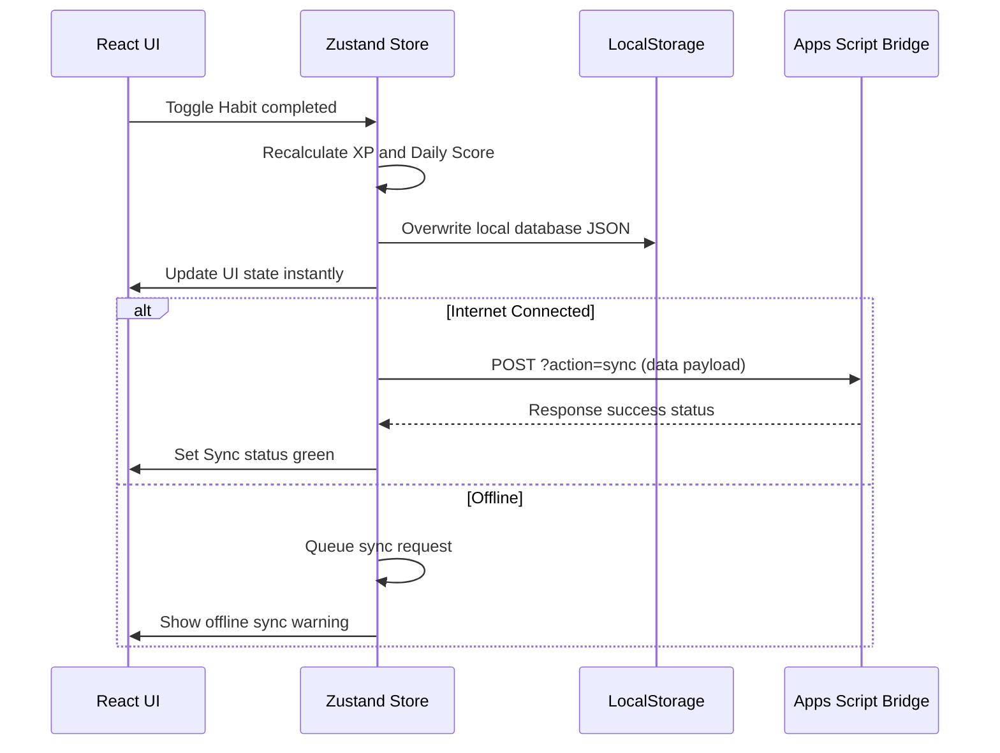
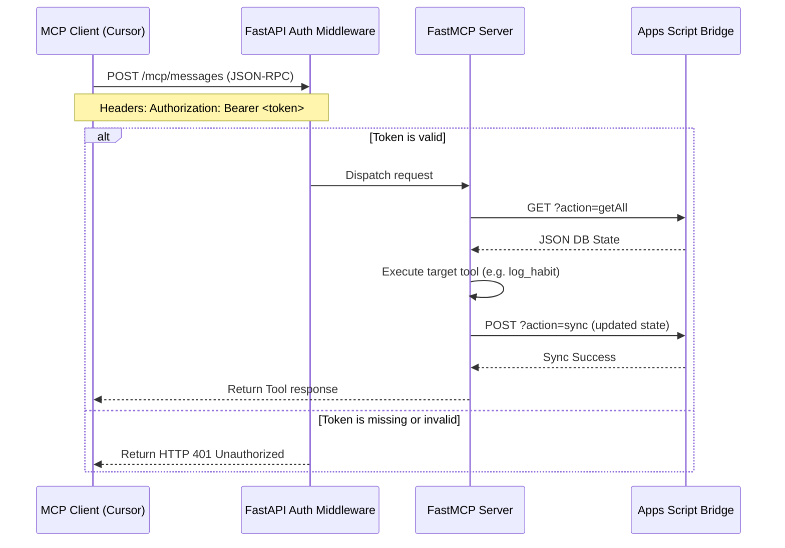

# 🚀 BakaTracker

[](docs/LICENSE.md)
[](https://www.typescriptlang.org/)
[](https://react.dev/)
[](https://workers.cloudflare.com/)
[](https://developers.cloudflare.com/d1/)
[](https://console.cloud.google.com/)
[](https://developer.mozilla.org/en-US/docs/Web/Progressive_web_apps)
[](#)

> **BakaTracker** is a minimalist, gamified personal life operating system and RPG
> planner — **self-hostable** on Cloudflare (Workers + D1 + KV + Pages), with Google
> OAuth login, a REST API, and a Model Context Protocol (MCP) server so AI coding
> assistants can talk to your lifecycle ledger directly. Single-user by design:
> deploy your own instance, own your data, zero subscriptions.

---

## ⚡ Deploy your own instance

BakaTracker is built to be **forked and self-hosted** — each instance is fully
independent (own Worker, own D1, own KV, own OAuth client). No shared backend,
no SaaS.

```bash
git clone https://github.com/<you>/BakaTracker.git
cd BakaTracker
npm install && (cd platform && npm install)

npm run setup      # 1. Cloudflare resources + secrets + config (interactive)
#    → register the printed Google redirect URI in Google Cloud Console
npm run deploy     # 2. deploy the Worker (API + OAuth + MCP)

# 3. publish the frontend on Cloudflare Pages with
#    VITE_API_BASE_URL=<your worker origin> (see docs/DEPLOYMENT.md)
```

Full step-by-step for absolute beginners: **[docs/DEPLOYMENT.md](docs/DEPLOYMENT.md)**.
Every configuration value explained: **[docs/CONFIGURATION.md](docs/CONFIGURATION.md)**.

| Deployment mode | When |
|---|---|
| `npm run setup` → `npm run deploy` | recommended (automatic D1/KV/secrets/config) |
| manual `wrangler` commands | you know Wrangler and want full control |

---

## 🗺️ Table of Contents

1. [Philosophies & Core Principles](#-philosophies--core-principles)
2. [Feature Showcase](#-feature-showcase)
3. [Technical Architecture](#-technical-architecture)
4. [Folder Structure](#-folder-structure)
5. [Database Schema Mapping](#-database-schema-mapping)
6. [Authentication & Security Modes](#-authentication--security-modes)
7. [Model Context Protocol (MCP) Integration](#-model-context-protocol-mcp-integration)
8. [Installation Guide](#-installation-guide)
9. [Deployment Guide](#-deployment-guide)
10. [Developer Guidelines](#-developer-guidelines)
11. [Troubleshooting & FAQ](#-troubleshooting--faq)
12. [Roadmap & Contribution](#-roadmap--contribution)

---

## 🧠 Philosophies & Core Principles

Traditional productivity applications often feel like additional jobs. They induce "productivity guilt" by demanding endless nested organization, classification tags, and complex setups. BakaTracker is the antidote.

* **Low-Friction UI Design**: Decreases friction and cognitive load. Daily check-ins are quick, drag-and-drop is limited to high-priority areas, and positive 8-bit aesthetic feedback keeps users engaged without overwhelming them.
* **Consistency over Intensity**: Streaks are calculated supportively, and daily scores reward showing up over achieving perfection.
* **Local-First & Offline-Capable**: The React client stores data directly inside LocalStorage. Changes are instant, and state updates sync in the background when an internet connection is available.
* **Zero-Cost Personal Cloud**: No external database hosting costs or subscriptions. A personal Google Sheet serves as the serverless relational database backend, proxied by a Google Apps Script Web App.
* **Isolated AI Interface**: No AI assistant cluttering the frontend codebase. Instead, BakaTracker exposes a standard Model Context Protocol (MCP) server so coding assistants (like Cursor, Claude Desktop, or Roo Code) can interact directly with your lifecycle ledger.

---

## 🎨 Feature Showcase

* **Habits Tracker**: Logs daily behaviors with tailored interaction types:
  * *Checkbox*: Single completion toggle (e.g. GYM).
  * *Counter*: Incremental tally tracker (e.g. glasses of water, pages read).
  * *Numeric*: Numerical logs (e.g. sleep duration, screen time).
  * *Mood & Energy*: Emoji selections (`😞`, `😐`, `🙂`) and level scales (`Low`, `Medium`, `High`).
* **Kanban Backlog Planner**: Organize long-term tasks across a 4-column master board (`Backlog`, `Todo`, `Doing`, `Done`).
* **Today Focus Board**: A dedicated viewport containing starred tasks from your master backlog.
* **Spotlight Focus Mode**: When you drag a Quest to the "Doing" column on your Today board, the screen dims around it to eliminate digital distractions.
* **Highlight Journaling**: Encourages reflection by prompting you to record a single-sentence daily win alongside optional bullet journals.
* **RPG Character HUD**: Earn attribute experience (XP) across **Discipline, Health, Knowledge, Creativity, and Career** categories. Level up your character and unlock tier milestones.
* **Journey Analytics**: View consistency heatmaps, Recharts weekly recap graphs, and automatic insights.

---

## 🏗️ Technical Architecture

BakaTracker uses a highly distributed, decoupled architecture:
1. **React Web App Client**: Deployed to Cloudflare Pages. Built as a Progressive Web App (PWA). Uses Zustand for state management and local replication.
2. **FastAPI & FastMCP Web Service**: Containerized API gateway hosted on Google Cloud Run. Validates OIDC JWT tokens or Bearer tokens, registers MCP tools, and routes client requests.
3. **Google Sheets Database Layer**: Google Sheet spreadsheets with a Google Apps Script API proxy acting as a transactional endpoint.


### Data Flows

#### Local-First Background Synchronization


#### Protected Remote MCP Access (JSON-RPC)


---

## 📂 Folder Structure

```
BakaTracker/
├── .github/                  # GitHub Actions CI/CD pipelines
│   └── workflows/
│       └── deploy.yml              # Test execution and Docker build triggers
├── backend/                  # FastMCP service & FastAPI gateway code
│   ├── auth/                       # JWT validation & middleware modules
│   ├── models/                     # Pydantic schemas for Google Sheets collections
│   ├── services/
│   │   └── sheets_client.py        # Resilient Sheets API proxy client
│   ├── tools/                      # MCP tool action controllers
│   ├── config.py                   # Environment configuration loader
│   ├── Dockerfile                  # Container packaging spec
│   ├── main.py                     # FastAPI server entry point
│   └── server.py                   # FastMCP instance setup & tool registrations
├── docs/                     # Detailed architectural manuals
│   ├── ARCHITECTURE.md             # Topology design guidelines
│   ├── API.md                      # FastAPI REST endpoints
│   ├── DATABASE.md                 # Spreadsheet schemas
│   ├── USER_GUIDE.md               # User interface instruction manual
│   └── MCP.md                      # Model Context Protocol details
├── public/                   # Public assets (PWA manifest, icons)
├── src/                      # React 19 Frontend source code
│   ├── components/                 # Reusable layout and modular screens
│   ├── lib/                        # Stats, streaks, and utility functions
│   ├── pages/                      # Habits, Tasks, Today, Journal, and Journey pages
│   ├── services/                   # Frontend sheet REST endpoints wrapper
│   ├── store/
│   │   └── useStore.ts             # State store (Zustand + local caching)
│   └── types/
│       └── index.ts                # TypeScript interfaces
├── google-apps-script.js     # Sheets transactional REST script
└── package.json              # NPM configuration
```

---

## 🗄️ Database Schema Mapping

BakaTracker maps **10 database tables** to tabs in a single Google Sheets spreadsheet:

| Table Name | Primary Key | Foreign Keys | Description | Key Columns |
| :--- | :--- | :--- | :--- | :--- |
| **Settings** | `key` | *None* | Configuration settings. | `sheets_url`, `xp_per_level`, `api_key` |
| **Habits** | `id` | *None* | Definitions for habits. | `name`, `type`, `xp`, `stat`, `active` |
| **HabitLogs** | `id` | `habit_id` $\to$ `Habits.id` | Daily habit completion logs. | `date`, `value`, `xp_earned` |
| **Tasks** | `id` | *None* | Backlog and daily tasks. | `title`, `status`, `today`, `due_date`, `xp` |
| **Journal** | `id` | `quote_id` $\to$ `Quotes.id` | Daily journals and highlight. | `date`, `highlight`, `notes`, `mood` |
| **Events** | `id` | `entity_id` $\to$ `Habits/Tasks` | System-wide ledger of XP gains. | `type`, `source`, `xp`, `stat`, `timestamp` |
| **Character** | `id` | *None* | User character profiles cache. | `level`, `total_xp`, `discipline`, `health` |
| **WeeklyStats** | `week_start` | *None* | Summarized weekly attribute XP. | `xp`, `health`, `knowledge`, `career` |
| **Metadata** | `schema_version`| *None* | System schema metadata. | `schema_version`, `last_sync` |
| **Quotes** | `id` | *None* | Motivational quote library. | `quote`, `author`, `category`, `active` |

For columns, data types, and constraint definitions, refer to [DATABASE.md](docs/DATABASE.md).

---

## 🛡️ Authentication & Security Modes

BakaTracker implements a dual-mode authentication layer to secure backend endpoints:

### 1. Legacy Mode (`AUTH_MODE=legacy`)
Recommended for simple private self-hosting. In this mode, the gateway checks for a matching static token:
* Secure incoming requests using `Authorization: Bearer <AUTH_TOKEN>`.
* The `AUTH_TOKEN` is shared between the React PWA and the FastAPI backend.

### 2. JWT Mode (`AUTH_MODE=jwt`)
For secure installations or multi-device setups using OIDC. It integrates [Auth0](https://auth0.com/) for OAuth 2.0 token validation:
* **JWT Signature Checks**: Downloads the JWKS public key from the Auth0 tenant and validates signatures (`RS256`).
* **Audience & Issuer Validation**: Validates the payload claims against configured parameters.
* **Owner Constraint**: Ensures the verified token's `email` matches the configured `OWNER_EMAIL`.

### Fail-Fast Startup Validation
When using JWT authentication, the server performs checks on startup. If any parameters are missing, malformed, or unsecured (e.g. http:// instead of https:// for issuer URLs), the FastAPI application halts startup immediately.

---

## 🔌 Model Context Protocol (MCP) Integration

BakaTracker includes a **FastMCP** server that exposes its features as tools, prompts, and resources. This allows coding assistants (like Cursor, Claude Desktop, and ChatGPT) to read and modify your life tracking data.

### Exposed Interface

```
                       ┌──────────────────────┐
                       │   FastMCP Instance   │
                       └──────────┬───────────┘
                                  │
          ┌───────────────────────┼───────────────────────┐
          ▼                       ▼                       ▼
     [22 Tools]              [6 Resources]            [1 Prompt]
  • get_habits            • bakatracker://character • daily_review
  • log_habit             • bakatracker://today
  • create_task           • bakatracker://weekly
  • save_journal_entry    • bakatracker://journal
  • quick_log             • bakatracker://events
  • export_life_report    • bakatracker://journey
```

### Client Configuration Setups

#### 1. Cursor Setup
1. Go to **Cursor Settings** > **Features** > **MCP**.
2. Click **+ Add New MCP Server**:
   - **Name**: `BakaTracker`
   - **Type**: `http`
   - **URL**: `http://localhost:8080/mcp/http/` (Streamable HTTP, recommended) or `http://localhost:8080/mcp` (SSE)
   - **Headers**:
     - Key: `Authorization`
     - Value: `Bearer <your_auth_token>`

#### 2. Claude Desktop Setup
Open your configuration file (`claude_desktop_config.json`):
* **Windows**: `%APPDATA%\Claude\claude_desktop_config.json`
* **macOS**: `~/Library/Application Support/Claude/claude_desktop_config.json`

Add the following config:
```json
{
  "mcpServers": {
    "bakatracker": {
      "command": "uv",
      "args": [
        "--directory",
        "C:/path/to/BakaTracker/backend",
        "run",
        "main.py"
      ],
      "env": {
        "GOOGLE_APPS_SCRIPT_URL": "https://script.google.com/macros/s/.../exec",
        "AUTH_TOKEN": "your_auth_token_here",
        "GOOGLE_APPS_SCRIPT_API_KEY": "your_api_key_here"
      }
    }
  }
}
```

#### 3. Custom GPT Action (ChatGPT)
FastMCP's streamable HTTP endpoint supports Custom GPT actions:
1. Create a custom GPT.
2. In **Actions** > **Create new action**, import the OpenAPI spec from `http://localhost:8080/openapi.json`.
3. Set authentication to **API Key (Bearer)** and supply your `AUTH_TOKEN`.

---

## ⚙️ Installation Guide

> Full walkthrough for first-time self-hosters: **[docs/DEPLOYMENT.md](docs/DEPLOYMENT.md)**.

### Prerequisites

* Node.js ≥ 20
* A Cloudflare account (free tier works)
* A Google account (to create the OAuth client)

### Quick setup (Mode A — recommended)

```bash
# 1. Install
git clone https://github.com/<you>/BakaTracker.git
cd BakaTracker
npm install && (cd platform && npm install)

# 2. Cloudflare auth
export CLOUDFLARE_API_TOKEN=<your-api-token>   # or: cd platform && npx wrangler login

# 3. One-command setup: creates D1 + KV (and optionally R2), writes the
#    generated platform/wrangler.prod.jsonc, stores secrets, applies migrations,
#    and prints your exact Google redirect URI.
npm run setup

# 4. Deploy the Worker (REST API + OAuth + MCP)
npm run deploy

# 5. Frontend — Cloudflare Pages: connect this repo, build command `npm run build`,
#    output `dist`, and set VITE_API_BASE_URL=<worker origin> +
#    VITE_GOOGLE_CLIENT_ID=<client id> as production environment variables.
```

### Local development

```bash
cd platform && npx wrangler dev    # Worker API on http://localhost:8787
# in another terminal:
npm run dev                        # React PWA on http://localhost:5173
```

Copy `platform/.dev.vars.example` → `platform/.dev.vars` and fill in local
secrets. Wrangler simulates D1/KV locally — no Cloudflare resources required.

### Manual deployment (Mode B)

Advanced users can skip `npm run setup` and configure Wrangler by hand — see
**Mode B — Manual deployment** in [docs/DEPLOYMENT.md](docs/DEPLOYMENT.md).

---

## 🛠️ Developer Guidelines

If you want to contribute to BakaTracker, please follow these guidelines:

1. **Zustand Core Actions**: Never trigger direct backend REST calls inside React components. All operations should run through Zustand store actions in `src/store/useStore.ts` to ensure local caching and sync queuing work properly.
2. **Explicit Awaits**: FastMCP actions are asynchronous. Ensure you use `await` statements on all database pings.
3. **Resiliency Policies**: The Sheets client uses an exponential **3x retry backoff** (0.5s, 1s, 2s) with a **10s request timeout** to handle network hiccups. Ensure custom endpoints use similar retry mechanics.
4. **Clean Diffs**: Retain unrelated comments and docstrings. Check that your code compiles using `npm run build` before pushing.

---

## 💬 Troubleshooting & FAQ

### 1. Why am I getting CORS errors on the frontend?
Ensure the Apps Script web app is deployed with **Who has access** set to `Anyone`. If it is set to `Anyone with a Google account`, the browser will block requests due to CORS.

### 2. Can I use Excel instead of Google Sheets?
No. BakaTracker's sync engine is built around Google Apps Script Web App endpoints, which are unique to the Google Workspace ecosystem.

### 3. How does BakaTracker handle conflicts if I update data on multiple devices?
Currently, BakaTracker uses a "last-write-wins" policy. Implementing an offline merge-timestamp conflict resolution dashboard is a goal for Version 1.1.

### 4. What happens if the backend fails to connect to Google Sheets during boot?
The backend will log a warning but will continue to run to allow you to configure settings. Ensure `GOOGLE_APPS_SCRIPT_URL` is set correctly in your environment variables.

### 5. Why am I getting 401 Unauthorized errors on MCP?
Check that your MCP client includes the header `Authorization: Bearer <AUTH_TOKEN>`. If you are using JWT mode, ensure the token is valid, unexpired, and its email matches the configured `OWNER_EMAIL`.

---

## 🗺️ Roadmap & Contribution

BakaTracker is licensed under the **MIT License**. Contributions are welcome! For instructions, read [docs/CONTRIBUTING.md](docs/CONTRIBUTING.md).

### Upcoming Goals
* **Conflict Resolution**: Merge dashboards to resolve offline conflicts.
* **Habit Archiving**: Hide completed habits without losing their historical records.
* **SQL Database Fallback**: Standalone IndexedDB/SQLite support to run BakaTracker without Google Sheets.
* **Progress Badges**: Unlockable accomplishments and progression badges.
