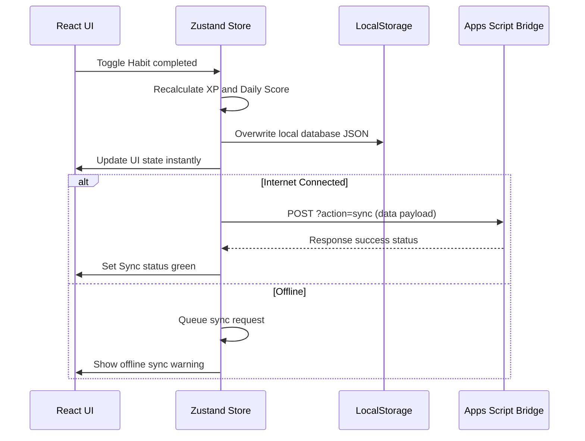
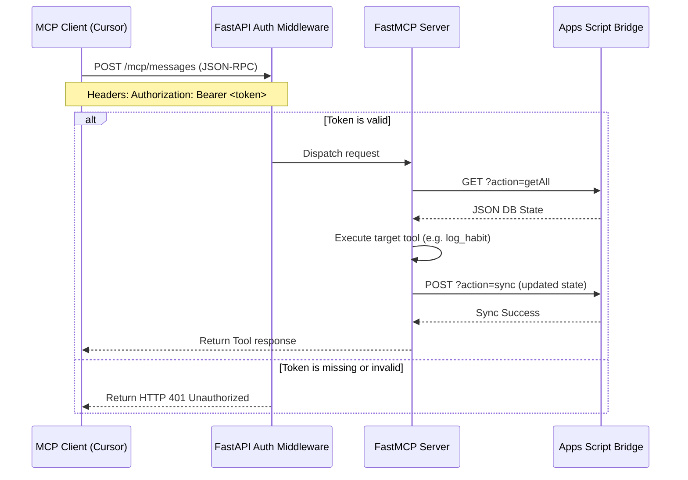

# 🏗️ Technical Architecture Manual

This document details the system design, components, and data pipelines for BakaTracker.

---

## 🏛️ System Overview

BakaTracker is split into a frontend client and an isolated backend gateway that interact with a Google Sheets database via a serverless Apps Script bridge.

```mermaid
graph TD
    subgraph Client Layer (Cloudflare Pages)
        React[React PWA App]
        Zustand[Zustand Store]
        LocalDB[(Browser LocalStorage)]
    end

    subgraph Interface API Gateway (Google Cloud Run)
        FastAPI[FastAPI Web App]
        FastMCP[FastMCP Server Instance]
    end

    subgraph Database Layer (Google Drive)
        AppsScript[Google Apps Script Bridge]
        Sheets[(Google Sheets Spreadsheet)]
    end

    React <-->|Zustand state bindings| Zustand
    Zustand <-->|Read / Write cache| LocalDB
    Zustand -->|syncData POST| AppsScript
    AppsScript <-->|Read / Write API| Sheets
    
    FastAPI <-->|Route requests| FastMCP
    FastMCP -->|fetch_db / save_db| AppsScript
    
    Claude[Claude Desktop / Cursor] <-->|Bearer Auth JSON-RPC| FastAPI
```

---

## 🛠️ Components Breakdown

### 1. Frontend Client (React + Zustand)
* **Local-First Writes:** User interactions (checking off habits, changing task columns) write immediately to the Zustand store and browser `localStorage`.
* **State Normalizer:** Verifies model configurations on boot and recalculates RPG level metrics locally.
* **Sync Engine:** Monitors network connectivity. Toggles `syncStatus` state and issues background POST payloads to push JSON database collections.

### 2. Interface API Gateway (FastAPI + FastMCP)
* **FastAPI Server:** Provides public health probes (`/health`, `/version`) and protected metadata/ready checks (`/info`, `/metrics`, `/ready`).
* **FastMCP Server:** Exposes 22 Python tools and 5 Markdown resources. Mounts to `/mcp` over Streamable HTTP or SSE transports.
* **Database Proxy Client:** Performs HTTP operations to Google Apps Script using a strict 10s timeout and a 3-retry backoff policy.

### 3. Database Bridge (Google Apps Script + Sheets)
* **Spreadsheet:** Holds 10 sheets representing a database schema.
* **Script Bridge:** Serves as a stateless REST bridge. On `GET?action=getAll`, it returns a flat JSON dictionary of sheet collections. On `POST?action=sync`, it parses the JSON arrays and overwrites spreadsheet rows.

---

## 🔄 Core Workflows

### PWA State Synchronization Flow



### Bearer Token Authentication Flow


